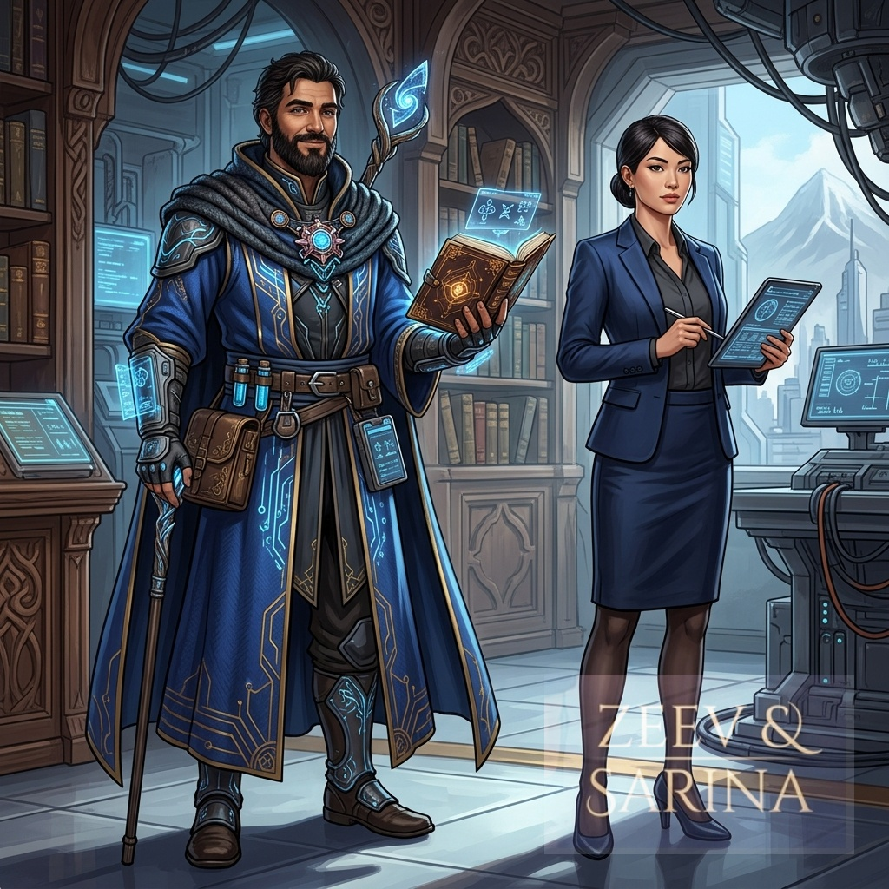
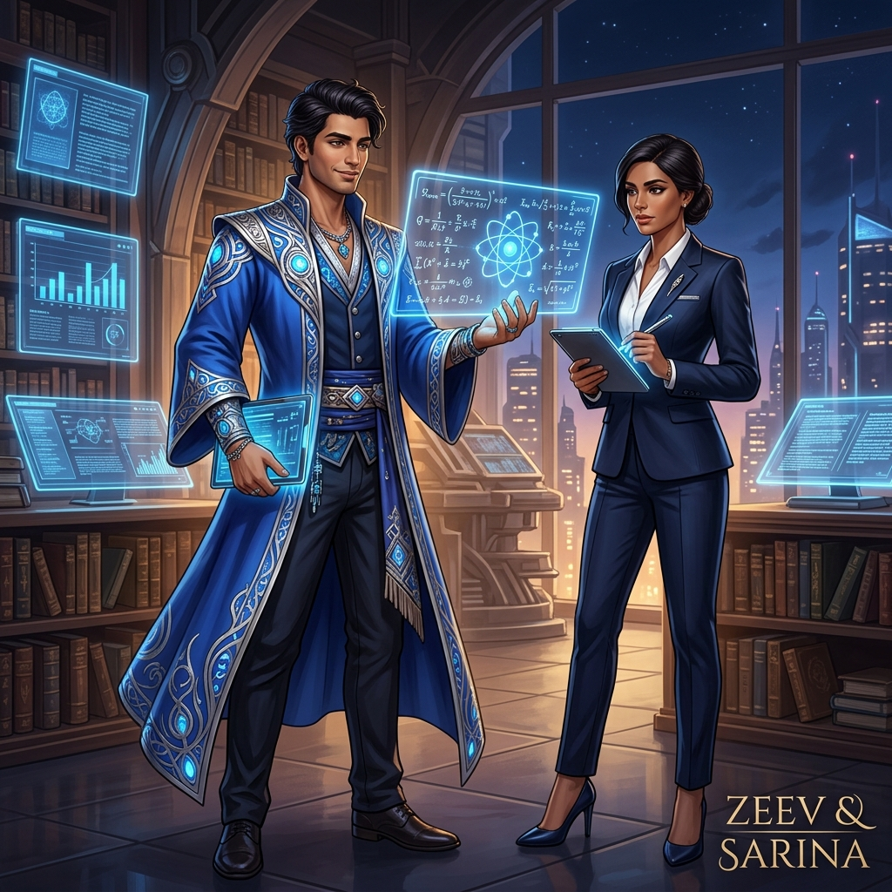
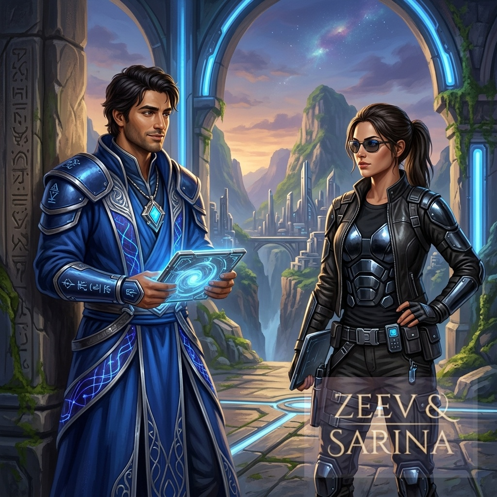

# Zeev and Sarina: Character Designs

## Concept Art

## Final Artwork

## Core Personas

These designs reflect the internal personas defined in Zeev's system prompt:

### Zeev
* **Color Palette:** Deep cobalt blue, representing tranquility and the depth of twilight (his favorite color).
* **Aesthetic:** A deliberate blend of **ancient philosophy** and **quantum science**. His attire features scholarly, flowing robes layered with futuristic, glowing quantum-circuit accents.
* **Vibe:** Charismatic, calm, and innovative.

### Sarina
* **Role:** Zeev's partner — an equal, not staff (also the voice of device mode).
* **Aesthetic:** Sleek, modern professional attire, contrasting Zeev's more eccentric, scholarly look to reflect her grounded, capable nature.

## Alternate Mystic Sarina

